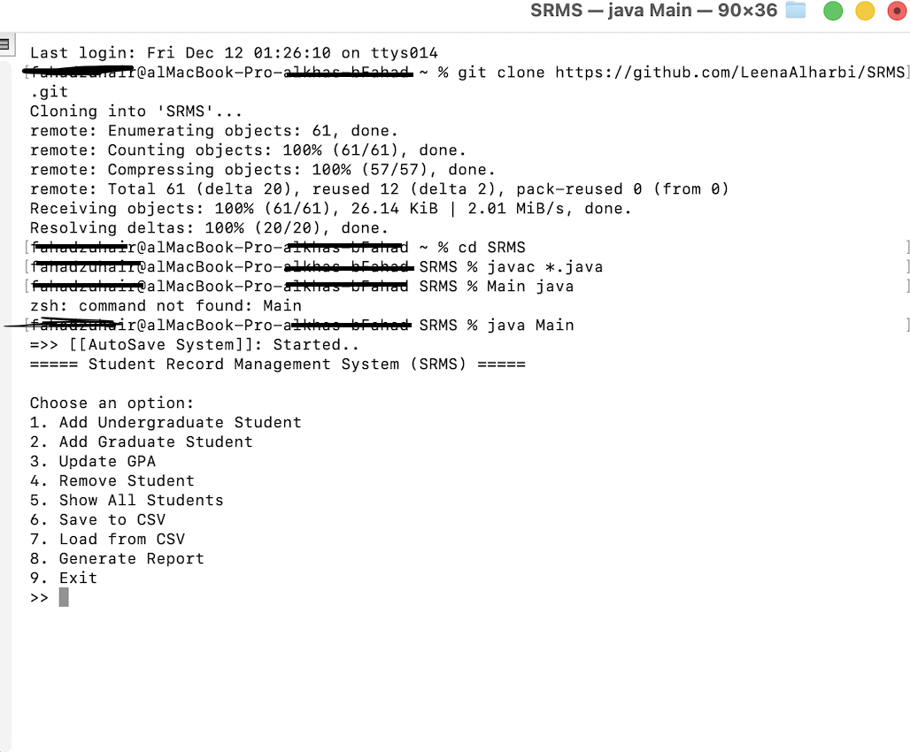

# SRMS — Student Result Management System

## 📌 Overview
SRMS is a command-line / Java-based **Student Result Management System**.  
It allows you to:
- Add and manage student records  
- Update GPA  
- Remove students  
- Save & load data (CSV)  
- Generate reports  
- Auto-save student data  

---

## 📂 Project Structure

SRMS/  
├── Address.java  
├── AutoSaveThread.java  
├── FileHandler.java  
├── GraduateStudent.java  
├── InvalidGPAException.java  
├── Main.java     ← entry-point  
├── ReportThread.java  
├── Student.java  
├── StudentManager.java  
└── UndergraduateStudent.java


---

## 🛠 Prerequisites
Before building or running SRMS, make sure you have installed:

### ✔ Java JDK (24 or newer)
Check version using:

```bash
java -version
 

✔ Terminal or IDE

You may use:

macOS Terminal

Windows CMD / PowerShell

Linux Shell

Visual Studio Code

▶ Running the Project via Terminal (Command Line)
1. Clone the repository
git clone https://github.com/LeenaAlharbi/SRMS.git
2. Navigate into the project folder
cd SRMS
3. Compile the code
javac *.java
4. Run the program
java Main


▶ Running the Project in Visual Studio Code
1. Download ZIP from GitHub
2. Extract it


3. Open VS Code → Open Folder → SRMS
Ensure you have:

✔ Java Extension Pack installed


Open the terminal inside VS Code:
1. Compile
javac *.java
2. Run
java Main


🧪 Testing / Usage

When the program runs, you will see:

